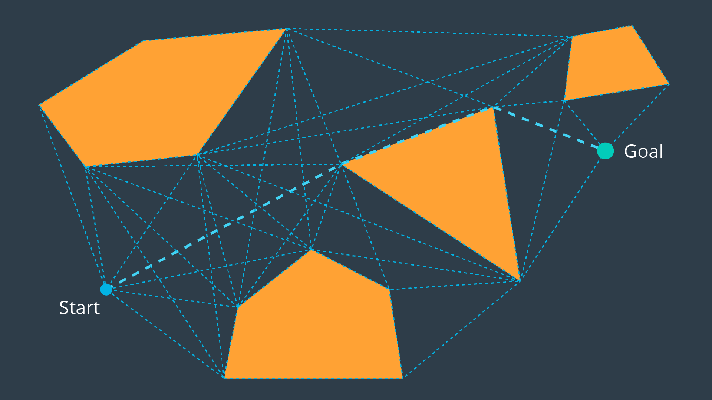

# Visibility Graph

The Visibility Graph builds a roadmap by connecting the start node, all of the obstacles’ vertices, and goal node to each other - except those that would result in collisions with obstacles. The Visibility Graph has its name for a reason - it connects every node to all other nodes that are ‘visible’ from its location.

> **Nodes:** Start, Goal, and all obstacle vertices.

> **Edges:** An edge between two nodes that does not intersect an obstacle, including obstacle edges.

The following image illustrates a visibility graph for a configuration space containing polygonal obstacles.

The motivation for building Visibility Graphs is that the shortest path from the start node to the goal node will be a piecewise linear path that bends only at the obstacles’ vertices. This makes sense intuitively - the path would want to hug the obstacles’ corners as tightly as possible, as not to add any additional length.

Once the Visibility Graph is built, a search algorithm can be applied to find the shortest path from Start to Goal. The image below displays the shortest path in this visibility graph.

## Quiz

Although the algorithms used to search the roadmap have not yet been introduced - it is still worth analysing whether any algorithm would be able to find a path from start to goal, and whether the optimal path lies within the roadmap.

> Is the visibility graph complete? Does it contain the optimal path?
>
> - [x] Complete
> - [x] Optimal
> - [ ] Neither
>
> That’s right, it is complete and contains the optimal path!

Having completed the quiz, you should have by now seen the advantages of the Visibility Graph method. One disadvantage to the Visibility Graph is that it leaves no clearance for error. A robot traversing the optimal path would have to pass incredibly close to obstacles, increasing the risk of collision significantly. In certain applications, such as animation or path planning for video games, this is acceptable. However the uncertainty of real-world robot localization makes this method impractical.