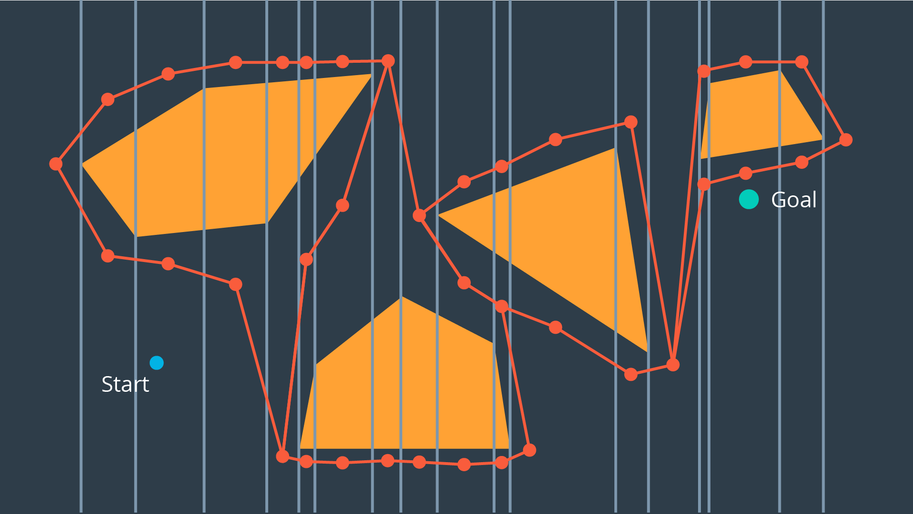

# Cell Decomposition

Another discretization method that can be used to convert a configuration space into a representation that can easily be explored by a search algorithm is cell decomposition. Cell decomposition divides the space into discrete cells, where each cell is a node and adjacent cells are connected with edges. There are two distinct types of cell decomposition:

- Exact Cell Decomposition
- Approximate Cell Decomposition.

## Exact Cell Decomposition

Exact cell decomposition divides the space into _non-overlapping_ cells. This is commonly done by breaking up the space into triangles and trapezoids, which can be accomplished by adding vertical line segments at every obstacle’s vertex. You can see the result of exact cell decomposition of a configuration space in the image below.

Once a space has been decomposed, the resultant graph can be used to search for the shortest path from start to goal. The resultant graph can be seen in the image below.

Exact cell decomposition is elegant because of its precision and completeness. Every cell is either ‘full’, meaning it is completely occupied by an obstacle, or it is ‘empty’, meaning it is free. And the union of all cells exactly represents the configuration space. If a path exists from start to goal, the resultant graph _will_ contain it.

To implement exact cell decomposition, the algorithm must order all obstacle vertices along the x-axis, and then for every vertex determine whether a new cell must be created or whether two cells should be merged together. Such an algorithm is called the Plane Sweep algorithm.

Exact cell decomposition results in cells of awkward shapes. Collections of uniquely-shaped trapezoids and triangles are more difficult to work with than a regular rectangular grid. This results in an added computational complexity, especially for environments with greater numbers of dimensions. It is also difficult to compute the decomposition when obstacles are not polygonal, but of an irregular shape.

For this reason, there is an alternate type of cell decomposition, that is much more practical in its implementation.