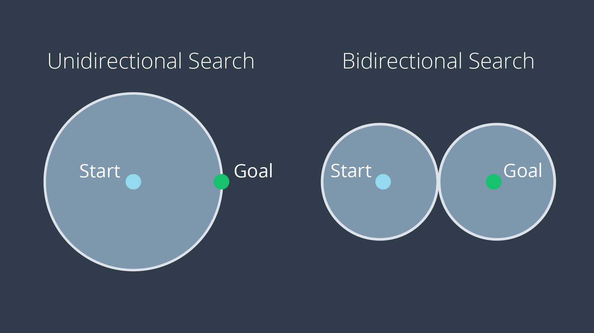

# Overall Concerns Regarding Search

## Bidirectional Search
One way to improve a search’s efficiency is to conduct two searches simultaneously - one rooted at the start node, and another at the goal node. Once the two searches meet, a path exists between the start node and the goal node.

The advantage with this approach is that the number of nodes that need to be expanded as part of the search is decreased. As you can see in the image below, the volume swept out by a unidirectional search is noticeably greater than the volume swept out by a bidirectional search for the same problem.

## Path Proximity to Obstacles
Another concern with the search of discretized spaces includes the proximity of the final path to obstacles or other hazards. When discretizing a space with methods such as cell decomposition, empty cells are not differentiated from one another. The optimal path will often lead the robot very close to obstacles. In certain scenarios this can be quite problematic, as it will increase the chance of collisions due to the uncertainty of robot localization. The optimal path may not be the best path. To avoid this, a map can be ‘smoothed’ prior to applying a search to it, marking cells near obstacles with a higher cost than free cells. Then the path found by A* search may pass by obstacles with some additional clearance.

## Paths Aligned to Grid
Another concern with discretized spaces is that the resultant path will follow the discrete cells. When a robot goes to execute the path in the real world, it may seem funny to see a robot zig-zag its way across a room instead of driving down the room’s diagonal. In such a scenario, a path that is optimal in the discretized space may be suboptimal in the real world. Some careful path smoothing, with attention paid to the location of obstacles, can fix this problem.
