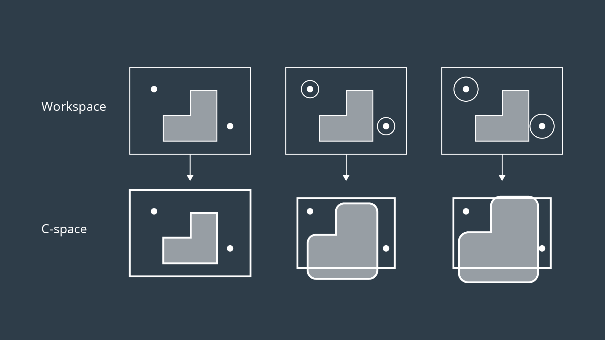

# Minkowski Sum

The Minkowski sum is a mathematical property that can be used to compute the configuration space given an obstacle geometry and robot geometry.

The intuition behind how the Minkowski sum is calculated can be understood by imagining to paint the outside of an obstacle using a paintbrush that is shaped like your robot, with the robot’s origin as the tip of the paintbrush. The painted area is C_obs. The image below shows just this.

To create the configuration space, the Minkowski sum is calculated in such a way for every obstacle in the workspace. The image below shows three configuration spaces created from a single workspace with three different sized robots. As you can see, if the robot is just a dot, then the obstacles in the workspace are only inflated by a small amount to create the C-space. As the size of the robot increases, the obstacles are inflated more and more.

For convex polygons, computing the convolution is trivial and can be done in linear time - however for non-convex polygons (i.e. ones with gaps or holes present), the computation is much more expensive.

If you are interested in understanding the Minkowski Sum in more detail, then you may find the following resources helpful:

- [A blog post on Minkowski sums and differences](http://twistedoakstudios.com/blog/Post554_minkowski-sums-and-differences) ([PDF](Minkowski%20sums%20and%20differences%20_%20Twisted%20Oak%20Studios%20Blog.pdf)),
- [An interesting read on how collisions are detected in video games](https://www.toptal.com/game/video-game-physics-part-ii-collision-detection-for-solid-objects) ([PDF](collision-detection-for-solid-objects-2020-06-05_9_57.pdf)).