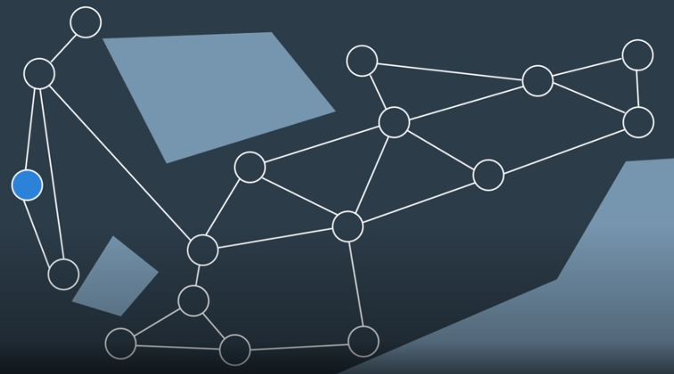

# Probabilistic Roadmap (PRM)




## Algorithm

The pseudocode for the PRM learning phase is provided below.

```
Initialize an empty graph
For n iterations:

   Generate a random configuration.
   If the configuration is collision free:

      Add the configuration to the graph.
      Find the k-nearest neighbours of the configuration.
      For each of the k neighbours:

         Try to find a collision-free path between
            the neighbour and original configuration.
            If edge is collision-free:
                Add it to the graph.
```

After the learning phase, comes the query phase.

## Setting Parameters
There are several parameters in the PRM algorithm that require tweaking to achieve success in a particular application. Firstly, the **number of iterations** can be adjusted - the parameter controls between how detailed the resultant graph is and how long the computation takes. For path planning problems in wide-open spaces, additional detail is unlikely to significantly improve the resultant path. However, the additional computation is required in complicated environments with narrow passages between obstacles. Beware, setting an insufficient number of iterations can result in a ‘path not found’ if the samples do not adequately represent the space.

Another decision that a robotics engineer would need to make is **how to find neighbors** for a randomly generated configuration. One option is to look for the k-nearest neighbors to a node. To do so efficiently, a [k-d](https://xlinux.nist.gov/dads/HTML/kdtree.html) tree can be utilized - to break up the space into ‘bins’ with nodes, and then search the bins for the nearest nodes. Another option is to search for any nodes within a certain distance of the goal. Ultimately, knowledge of the environment and the solution requirements will drive this decision-making process.

The choice for what type of **local planner** to use is another decision that needs to be made by the robotics engineer. The local planner demonstrated in the video is an example of a very simple planner. For most scenarios, a simple planner is preferred, as the process of checking an edge for collisions is repeated many times (k*n times, to be exact) and efficiency is key. However, more powerful planners may be required in certain problems. In such a case, the local planner could even be another PRM.

## Probabilistically Complete
As discussed before, sample-based path planning algorithms are probabilistically complete. Now that you have seen one such algorithm in action, you can see why this is the case. As the number of iterations approaches infinity, the graph approaches completeness and the optimal path through the graph approaches the optimal path in reality.

## Variants
The algorithm that you learned here is the vanilla version of PRM, but many other variations to it exist. The following link discusses several alternative strategies for implementing a PRM that may produce a more optimal path in a more efficient manner.

- [A Comparative Study of Probabilistic Roadmap Planners](papers/compare.pdf) ([source](http://www.staff.science.uu.nl/~gerae101/pdf/compare.pdf))

> The probabilistic roadmap approach is one of the leading motion planning techniques. Over the past eight years the technique has been studied by manydifferent researchers. This has led to a large number of variants of the approach,
> each with its own merits. It is difficult to compare the different techniques because
> they were tested on different types of scenes, using different underlying libraries,
> implemented by different people on different machines. In this paper we provide
> a comparative study of a number of these techniques, all implemented in a single
> system and run on the same test scenes and on the same computer. In particular we compare collision checking techniques, basic sampling techniques, and node
> adding techniques. The results should help future users of the probabilistic roadmap
> planning approach to choose the correct techniques.

## PRM is a Multi-Query Planner
The Learning Phase takes significantly longer to implement than the Query Phase, which only has to connect the start and goal nodes, and then search for a path. However, the graph created by the Learning Phase can be reused for many subsequent queries. For this reason, PRM is called a multi-query planner.

This is very beneficial in static or mildly-changing environments. However, some environments change so quickly that PRM’s multi-query property cannot be exploited. In such situations, PRM’s additional detail and computational slow nature is not appreciated. A quicker algorithm would be preferred - one that doesn’t spend time going in all directions without influence by the start and goal.

## Quiz Question

> Which of the following statements are true about Probabilistic Roadmaps?
>
> - [x]  PRM is a multi-query method (ie. the resultant graph can be used for multiple queries).
> - [x] If an insufficient iterations of the PRM algorithm are run, there is a risk of finding an inefficient path or not finding a path at all.
- > [ ] When A* is applied to the graph generated by PRM, the optimal path is found.
