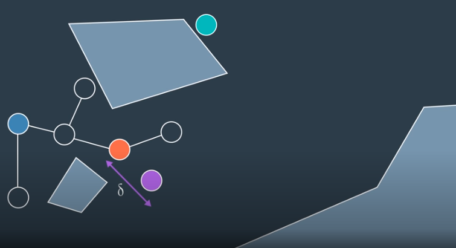
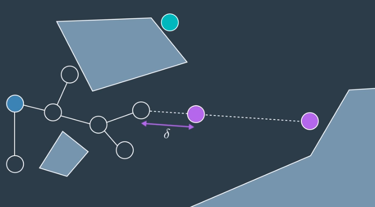

# Rapidly Exploring Random Tree Method (RRT)




## Algorithm

The pseudocode for the RRT learning phase is provided below.

```
Initialize two empty trees.
Add start node to tree #1.
Add goal node to tree #2.
For n iterations, or until an edge connects trees #1 & #2:

    Generate a random configuration (alternating trees).
    If the configuration is collision free:
        Find the closest neighbour on the tree to the configuration
        If the configuration is less than a distance δ away from the neighbour:
            Try to connect the two with a local planner.
    Else:
        Replace the randomly generated configuration
            with a new configuration that falls along the same path,
            but a distance δ from the neighbour.
        Try to connect the two with a local planner.

    If node is added successfully:
        Try to connect the new node to the closest neighbour.
```

## Setting Parameters
Just like with PRM, there are a few parameters that can be tuned to make RRT more efficient for a given application.

The first of these parameters is the **sampling method** (ie. how a random configuration is generated). As discussed in the video, you can sample uniformly - which would favour wide unexplored spaces, or you can sample with a bias - which would cause the search to advance greedily in the direction of the goal. Greediness can be beneficial in simple planning problems, however in some environments it can cause the robot to get stuck in a local minima. It is common to utilize a uniform sampling method with a small hint of bias.

The next parameter that can be tuned is δ. As RRT starts to generate random configurations, a large proportion of these configurations will lie further than a distance δ from the closest configuration in the graph. In such a situation, a randomly generated node will dictate the direction of growth, while δ is the growth rate.

Choosing a small δ will result in a large density of nodes and small growth rate. On the other hand, choosing a large δ may result in lost detail, as well as an increasing number of nodes being unable to connect to the graph due to the greater chance of collisions with obstacles. δ must be chosen carefully, with knowledge of the environment and requirements of the solution.

## Single-Query Planner
Since the RRT method explores the graph starting with the start and goal nodes, the resultant graph cannot be applied to solve additional queries. RRT is a single-query planner.

RRT is, however, much quicker than PRM at solving a path planning problem. This is so because it takes into account the start and end nodes, and limits growth to the area surrounding the existing graph instead of reaching out into all distant corners, the way PRM does. RRT is more efficient than PRM at solving large path planning problems (ex. ones with hundreds of dimensions) in dynamic environments.

Generally speaking, RRT is able to solve problems with 7 dimensions in a matter of milliseconds, and may take several minutes to solve problems with over 20 dimensions. In comparison, such problems would be impossible to solve with the combinatorial path planning method.

## RRT & Non-holonomic Systems
While we will not go into significant detail on this topic, the RRT method supports planning for non-holonomic systems, while the PRM method does not. This is so because the RRT method can take into consideration the additional constraints (such as a car’s turning radius at a particular speed) when adding nodes to a graph, the same way it already takes into consideration how far away a new node is from an existing tree.

## Quiz Question

> Which of the following statements are true about the Rapidly Exploring Random Tree method?
>
> - [ ] When a randomly generated configuration is greater than a distance, δ, from its closest neighbour, then the configuration is abandoned.
> - [x] RRT can be applied to path planning with non-holonomic systems.
> - [x] If δ is set to a large value, the algorithm’s efficiency will drop, as the local planner is more likely to encounter collisions along a longer path.
