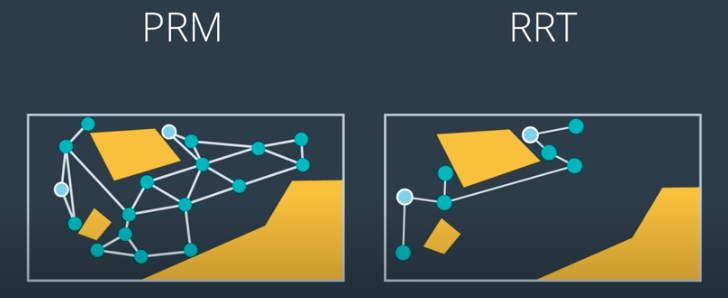
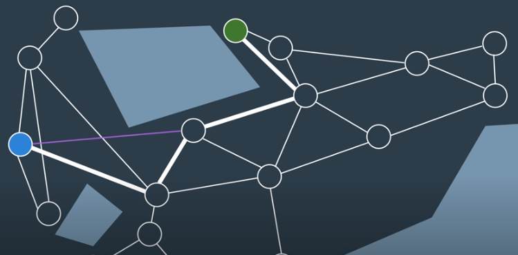
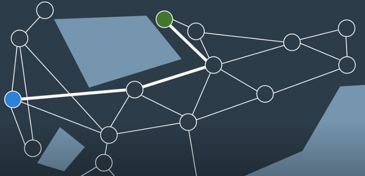

# Path Smoothing

Paths generated by PRM and RRT can be quite jerky.



Path smoothing seeks to create shortcuts where possible, by attempting to connect
subsequent nodes in the path:





## Algorithm

The following algorithm provides a method for smoothing the path by shortcutting.

```
For n iterations:

    Select two nodes from the graph
    If the edge between the two nodes is shorter than the existing path 
      between the nodes:

        Use local planner to see if edge is collision-free.
        If collision-free:

            Replace existing path with edge between the two nodes.
```

Keep in mind that the path’s distance is not the only thing that can be optimized by the Path Shortcutter algorithm - it could optimize for path smoothness, expected energy use by the robot, safety, or any other measurable factor.

After the Path Shortcutting algorithm is applied, the result is a more optimized path. It may still not be the optimal path, but it should have at the very least moved towards a local minimum. There exist more complex, informed algorithms that can improve the performance of the Path Shortcutter. These are able to use information about the workspace to better guide the algorithm to a more optimal solution.

For large multi-dimensional problems, it is not uncommon for the time taken to optimize a path to exceed the time taken to search for a feasible solution in the first place.
